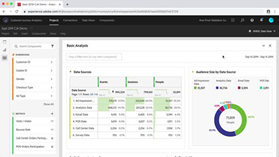

# Customer Journey Analytics 教學課程

歡迎使用 [!DNL Customer Journey Analytics] 教學課程網站。  使用這些教學課程和[文件](https://experienceleague.adobe.com/docs/analytics-platform/using/cja-landing.html?lang=zh-Hant)，能讓您更妥善地了解如何使用 Adobe Analytics，以更快的速度獲得多管道客戶分析。若要開始執行，

* 查看下面&#x200B;**「新增功能」**&#x200B;部分，了解許多最新有用小工具。
* **工作人員選擇**&#x200B;特別顯示我們最喜歡的一些內容
* 探索&#x200B;**左側導覽**&#x200B;中的主題和副主題內容。
* 如果你知道要尋找的內容，請使用頁面上方的「**搜尋**」欄位

Customer Journey Analytics 可讓您控制如何在 Analysis Workspace 中連接任何常見客戶 ID 的線上和離線資料，進而允許您進行歸因、區段、流量與流失等分析。整個客戶資料集。

## 新功能

* **[將 Adobe Analytics 區段移至 Customer Journey Analytics (影片)](components/filters/moving-adobe-analytics-segments-to-customer-journey-analytics.md)**

   *了解如何在 Customer Journey Analytics 中重新建立 Adobe Analytics 計算度量的提示。*

* **[將計算量度從 Adobe Analytics 移至 Customer Journey Analytics (影片)](components/calc-metrics/moving-your-calculated-metrics-from-adobe-analytics-to-customer-journey-analytics.md)**

   *了解在 Customer Journey Analytics 中重新建立 Adobe Analytics 計算度量的相關提示*

* **[建立跨管道篩選器 (影片)](components/filters/creating-cross-channel-filters-in-customer-journey-analytics.md)**

   *在 Customer Journey Analytics 中建立篩選器，使用多個資料來源和多個管道*

## 工作人員選擇

<table>
<tr>
  <td>
    
    

      <a href="visitor-id/understanding-how-customer-journey-analytics-uses-identity.md">
    <strong>了解 Customer Journey Analytics 如何使用身分</strong>
    </a>
    

    

    <em>實際了解身分如何影響您對 Customer Journey Analytics 的分析</em>
    

  </td>
   <td>
    
    

      <a href="architecture/architecture-and-integrations-of-cja.md">
    <strong>Customer Journey Analytics 的架構和整合</strong>
    </a>
    

    

    <em>Customer Journey Analytics 的架構介紹，其中包括與 Adobe Experience Platform 的集成。</em>
    

  </td>
  <td>
    
    

      <a href="visualizations/cross-channel-attribution-in-customer-journey-analytics.md">    <strong>Customer Journey Analytics 中的跨頻道歸因</strong>
    </a>
    

    

    <em>如何使用視覺效果顯示跨頻道歸因 (歸功)。</em>
    

  </td>
</tr>
</table>

