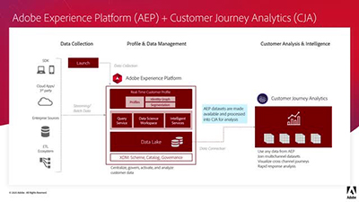
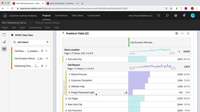

# 概覽

歡迎使用 [!DNL Customer Journey Analytics] 教學課程網站。使用這些教學課程以及[檔案](https://docs.adobe.com/content/help/zh-Hant/analytics-platform/using/cja-landing.html)，您將更瞭解如何使用Adobe Analytics，以前所未有的速度獲得多通道客戶見解。  若要開始執行，

* 查看下面&#x200B;**「新增功能」**&#x200B;部分，了解許多最新有用小工具。
* **工作人員選擇**&#x200B;特別顯示我們最喜歡的一些內容
* 探索&#x200B;**左側導覽**&#x200B;中的主題和副主題內容。
* 如果你知道要尋找的內容，請使用頁面上方的「**搜尋**」欄位

Customer Journey Analytics 可讓您控制如何在 Analysis Workspace 中連接任何常見客戶 ID 的線上和離線資料，進而允許您進行歸因、細分、流量與流失等分析。整個客戶資料集。

## 新功能

* **[將Adobe Analytics區段移至Customer Journey Analytics（視訊）](/help/moving-adobe-analytics-segments-to-customer-journey-analytics.md)**

   *瞭解如何在Customer Journey Analytics中重新建立Adobe Analytics區段的秘訣*

* **[將您的計算量度從Adobe Analytics移至Customer Journey Analytics（視訊）](/help/moving-your-calculated-metrics-from-adobe-analytics-to-customer-journey-analytics.md)**

   *瞭解在Customer Journey Analytics中重新建立Adobe Analytics計算量度的秘訣*

* **[建立跨通道濾鏡（視訊）](/help/creating-cross-channel-filters-in-customer-journey-analytics.md)**

   *在Customer Journey Analytics中建立篩選器，可運用多個資料來源和多個頻道*

## 工作人員選擇

<table>
<tr>
  <td>
    
    

      <a href="/help/understanding-how-customer-journey-analytics-uses-identity.md">
    <strong>瞭解Customer Journey Analytics如何使用身分</strong>
    </a>
    

    

    <em>從實際角度看身份對Customer Journey Analytics分析的影響</em>
    

  </td>
   <td>
    
    

      <a href="/help/architecture-and-integrations-of-cja.md">
    <strong>Customer Journey Analytics架構與整合</strong>
    </a>
    

    

    <em>Customer Journey Analytics建築的逐步介紹，包括與Adobe Experience Platform的整合。</em>
    

  </td>
  <td>
    
    

      <a href="/help/cross-channel-attribution-in-customer-journey-analytics.md">
    <strong>Customer Journey Analytics中的跨通道歸因</strong>
    </a>
    

    

    <em>如何使用視覺化來顯示跨通道的歸因（評分）。</em>
    

  </td>
</tr>
</table>
